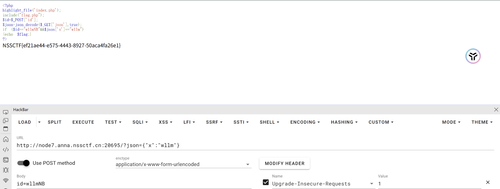

# [SWPUCTF 2021 新生赛]gift_F12


我还以为是要改今天的时间

# [SWPUCTF 2021 新生赛]jicao



要求post传入id值为wllNB，直接上传

## JSON

JSON（JavaScript Object Notation） 是一种轻量级的数据交换格式，它以易于阅读和编写的文本形式表示数据。JSON 最初是为JavaScript开发 的，但已成为一种 通用的数据格式，常用于数据存储与交换。

JSON 数据格式的特点


```
{
  "name": "John",
  "age": 30,
  "hometown": "New York",
  "pets": [
    {
      "name": "Fido",
      "species": "dog"
    },
    {
      "name": "Fluffy",
      "species": "cat"
    }
  ],
  "car": null
}
```
